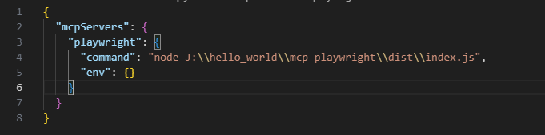
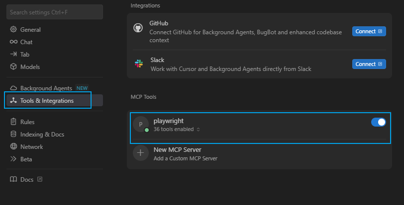

# MCP编译
## 环境
编译本项目需要计算机安装node.js（18.18.0版本可正常编译，低版本可先尝试后续操作，有问题再尝试升级）。


## 安装
在项目根目录中打开命令行，运行以下命令安装项目依赖
```
npm install
```

## 编译打包
项目根目录打开命令行，运行以下命令进行打包
```
npm run build
```
打包结果为根目录下的dist文件夹。

# MCP使用
上述打包后的dist文件就是MCP工具本身，入口文件为index.js。可以放在任意能使用MCP工具的程序中使用。
## cursor中使用
一、打开cursor设置页面，进入如图标签页，点击“New MCP Server”


二、点击后会进入“mcp.json”文件，将如下代码复制至“mcpServers”对象中（需要将路径修改为dist文件在你的计算机中的绝对路径），如图所示


```json
"playwright": {
      "command": "node X:\\xxx\\mcp-playwright\\dist\\index.js",
      "env": {}
    }
```

三、保存json文件之后就可使用了，如图所示即为可用状态


## 在MCP Inspector中使用
MCP Inspector是一个MCP调试工具，可以在可视化界面中对MCP工具进行调用、调试。

## 运行MCP Inspector
一、在计算机任意目录下打开命令行工具，执行如下命令，运行成功后展示如图界面
```
npx @modelcontextprotocol/inspector
```


二、浏览器访问上图红色框中的url，然后将蓝色框中的token填入下图对应位置中


三、然后将本项目打包后的dist文件的index.js的绝对路径填入Arguments中，如下图所示


四、点击connect按钮即可链接

五、点击Tools标签即可看到所有可用的MCP工具，并可选择其中某个工具，在右侧填入参数执行
